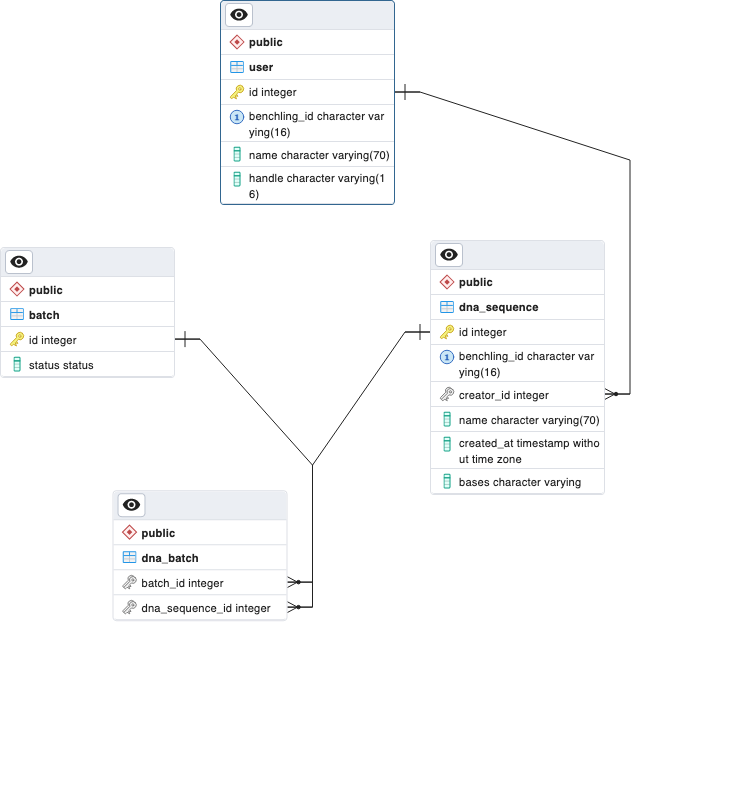

# DNA Sequence Service
## Overview
A proof-of-concept REST API service for storing, indexing, and searching for DNA sequences.

## Deployment
### Prerequisites
You will need `docker` to spin up service locally.

### Setup
The `.env` file included in the project is already configured with defaults to run the service locally. The environment variables include the following:
`DB_HOST`: Database Host (default="db")
`DB_PORT`: Database Port (default="5432")
`DB_USERNAME`: Database Username (default="postgres")
`DB_PASSWORD`: Database Password; used to create a create credentials in the container (default="dna")

### Running the Service
Run the following command:
```
docker compose up
```

You can then navigate to the locally running API [docs](http://localhost:8080/docs) (if you stuck with the default values) to view the API docs and try out the various operations.

### Quick Start

This project includes a test data set that was originally provided in the exercise email: `./data/test_batch_1.json`.
1. Open the `./data/test_batch_1.json` file and copy the contents.
2. Navigate to the DNA Sequence Batch [docs](http://localhost:8080/docs#/dna/create_dna_sequence_batch_dna_batch_post).
3. Click the __Try it out__ button.
4. Paste the contents into the __Request body__ section.
5. Click __Execute__.
6. You should receive a response w/ the newly created batch ID. This can be used to query for the upload status of the batch: `/dna/batch/{id}/status`
7. When the batch upload is complete you can use any of the `GET /dna/*` endpoints for querying, such as `GET /dna?pattern=ATTA`.

## Architecture
The service is implemented in Python + PostgreSQL using the following frameworks:

* FastAPI - Web framework for building REST APIs
* SQLAlchemy - Python database development framework (SQLAlchemy Core is used exclusively in this PoC)
* Pydantic - Python data modeling and validation library

### ER Diagram


## Considerations
> Performance and scalability: Design your service to scale to significantly larger datasets (ex: 500k sequences) with longer sequences (ex: 3m base pairs). What are the performance characteristics of your design? How does your design handle issues such as consistency, latency, and staleness?

The PostgreSQL `text` data type can store a maximum character string size of 1GB, which would equate to a maximum sequence size of ~1b base pairs. In theory, potentially larger sequences can be stored due to compression ([link](https://www.postgresql.org/docs/current/datatype-character.html)): 

> Long strings are compressed by the system automatically, so the physical requirement on disk might be less. Very long values are also stored in background tables so that they do not interfere with rapid access to shorter column values.

Since PostgreSQL is an ACID-compliant relational database system, the design of this system optimizes for consistency. However, for substantially larger datasets, a simple Postgres server will not scale well, so latency is likely to suffer. In order to compensate, we would likely need to deploy a high availability Postgres setup; [AWS offers a deployment guide for Aurora PostgreSQL for this](https://aws.amazon.com/solutions/implementations/aurora-postgresql/). Additionally, we could make use of [declarative partitioning](https://www.postgresql.org/docs/current/ddl-partitioning.html#DDL-PARTITIONING-DECLARATIVE) or an extension, such as [pg_partman](https://aws.amazon.com/solutions/implementations/aurora-postgresql/), to partition the `dna_sequence` table into smaller child tables; this is would likely improve the performance of pattern matching search queries if a suitable partitioning condition could be determined. Lastly, this service makes use of the `pg_trgm` extension, which offers to ability to declaring trigram indexes on text data; such an index can significantly improve the performance of infix pattern matching searches. In fact, Benchling employed a form of trigram indexing to implement [a regex search engine for DNA](https://benchling.engineering/building-a-regex-search-engine-for-dna-e81f967883d3). Overall, this rather simple setup provides options for addressing scalability issues that would require some investigation.

> Adaptability: How might it be possible to evolve your solution so that it could, for example, search by an arbitrary field or return a subset of data rather than the whole object?

Pydantic offers the ability include/exclude fields from serialization through the `BaseModel.dict`/`BaseModel.json` methods ([link](https://docs.pydantic.dev/usage/exporting_models/#modeljson)). This would allow us to implement an `exclude` query parameter in endpoints we wish to perform data filtering on, such as the `/dna` endpoints, that a client can use to exclude fields from the complete response body. For searching by arbitrary fields, we would need implement a series of query parameters per model field that dynamically construct the `WHERE` clause of an SQL `SELECT` query; this is well suited for SQLAlchemy SQL Expression API that is utilized in this project.
